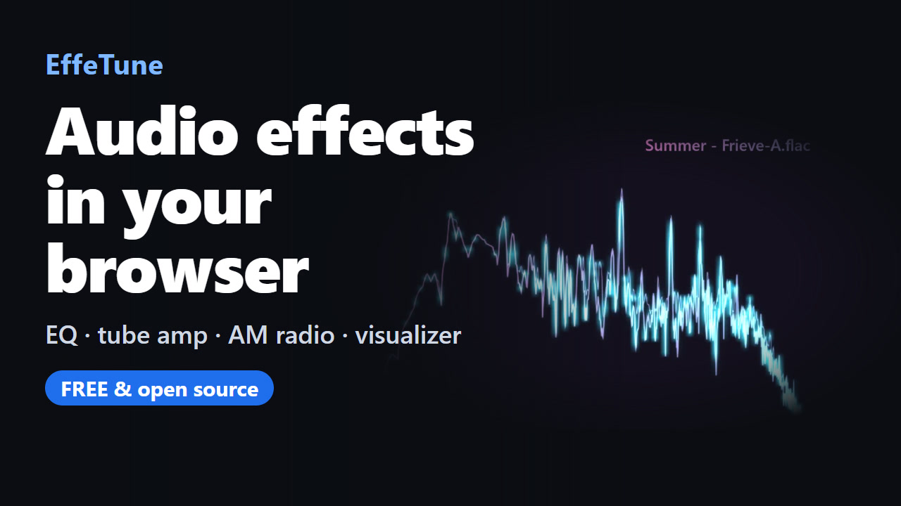

# Frieve EffeTune 

  <a class="button button-primary" href="https://effetune.frieve.com/effetune.html">Webアプリを開く</a>
  <install class="button button-secondary"><a href="https://effetune.frieve.com/effetune.html">PWA版をインストール</a></install>
  <a class="button button-secondary" href="/dsp/">DSP Library</a>
  <a class="button button-secondary" href="https://github.com/Frieve-A/effetune/releases/">デスクトップアプリをダウンロード</a>
  <a class="button button-secondary" href="https://github.com/Frieve-A/effetune-mixwright/releases">VST版をダウンロード</a>
  <a class="button button-secondary" href="https://chromewebstore.google.com/detail/effetune/fhjhnpepnhkcdggogicifibfegpbhibp">Chrome拡張版をインストール</a>
  <a class="button button-secondary" href="https://microsoftedge.microsoft.com/addons/detail/effetune/kjpcfdidpphaclfkfdahchhibgjcngdk">Edge拡張版をインストール</a>

オーディオ愛好家のためのリアルタイムオーディオエフェクトプロセッサです。EffeTuneを使うと、あらゆるオーディオソースに高品質なエフェクトをかけ、リスニング体験をリアルタイムで好みに合わせて調整できます。

### ブラウザ拡張版

仮想オーディオデバイスを使わずに、最大4つのChromeまたはEdgeのタブを独立したエフェクトで加工し、URL別プリセットとサンプリング周波数を設定できます。詳しくは[ブラウザ拡張版ガイド](browser-extension.md)をご覧ください。

## 紹介動画

## コンセプト

EffeTuneは、音楽をもっと好みの音で楽しみたいオーディオ愛好家のために作られました。ストリーミングで聴く場合でも、物理メディアで再生する場合でも、EffeTuneなら高品質なエフェクトを加え、好みに合わせて音を調整できます。あなたのコンピュータを、オーディオソースとスピーカーまたはアンプの間に置ける強力なオーディオエフェクトプロセッサに変えましょう。

オーディオの迷信ではなく、科学に基づいた音作りを。

## 機能

- リアルタイムオーディオ処理
- エフェクトチェーン構築のためのドラッグ＆ドロップインターフェース
- カテゴリ別に整理された拡張可能なエフェクトシステム
- ライブオーディオビジュアライゼーション
- 音声グラフ、ジャケット画像、曲情報を自由に配置できるVisualizer
- リアルタイムで変更可能なオーディオパイプライン
- 現在のエフェクトチェーンを使用したオフラインオーディオファイル処理
- ローカルのサブフォルダ、メタデータ、プレイリストを閲覧できるMusic Library
- システムキャリブレーションのための周波数特性測定と補正機能
- マルチチャンネル処理と出力
- スマートフォンやタブレットで使いやすいWebレイアウト
- エフェクトの数値設定で小数点、符号反転、入力範囲を扱えるモバイル用キーパッド
- Webアプリでの設定とオーディオ設定のブラウザ内保存
- インストール可能で、アプリ本体をオフラインでも開けるWebアプリ
- Web/PWA版とデスクトップ版に対応し、無音時の動作と音声入力の保持期間を設定できる省電力機能

## セットアップガイド

EffeTuneを使う前に、オーディオルーティングの設定が必要です。各種オーディオソースの設定方法は以下のとおりです:

### 音楽ファイルプレーヤーのセットアップ

- ブラウザでEffeTuneウェブアプリを開く、またはEffeTuneデスクトップアプリを起動する
- 音楽ファイルを開いて再生し、正常に再生されることを確認する
   - 音楽ファイルを開き、アプリケーションとしてEffeTuneを選択する（デスクトップアプリのみ）
   - またはファイルメニューから「音楽ファイルを開く...」を選択する（デスクトップアプリのみ）
   - または音楽ファイルをウィンドウにドラッグする
- 音楽ファイルプレーヤーだけで使う場合は、オーディオ設定の入力デバイスで「なし（音楽ファイルプレーヤー専用）」を選ぶと、ライブ入力を使わずに再生できます
- Shuffleの隣にある再生速度ボタンを押すとポップアップが開きます。9種類のプリセットから選ぶか、横スライダーまたは数値入力で0.25x〜4xの速度を0.01x刻みで設定できます。その横にある**ピッチ固定**ボタンは既定でオンになっており、速度を変えてもピッチが保たれます。オフにすると、テープやレコードの回転速度を変えたときのように、速度に応じてピッチも上下します。

### ストリーミングサービスのセットアップ

ストリーミングサービス（Spotify、YouTube Musicなど）からオーディオを処理するには:

1. 前提条件:
   - 仮想オーディオデバイスをインストールする（例: VB Cable、Voice Meeter、または ASIO Link Tool）
   - ストリーミングサービスの出力先を仮想オーディオデバイスに設定する

2. 設定:
   - ブラウザでEffeTuneウェブアプリを開く、またはEffeTuneデスクトップアプリを起動する
   - 入力ソースとして仮想オーディオデバイスを選択する
     - Chromeでは、初めて開いたときにオーディオ入力を選択して許可するダイアログボックスが表示されます
     - **設定** メニューの **オーディオ設定** から、入出力デバイスやオーディオ形式を選択します
   - ストリーミングサービスで音楽を再生する
   - EffeTuneを通じてオーディオが流れていることを確認する
   - より詳細なセットアップ手順については[FAQ](faq.md)を参照

### 外部オーディオ機器のセットアップ

CDプレーヤー、ネットワークプレーヤー、またはその他の外部オーディオ機器でEffeTuneを使うには:

- オーディオインターフェースをコンピュータに接続する
- ブラウザでEffeTuneウェブアプリを開く、またはEffeTuneデスクトップアプリを起動する
- 入力ソースと出力先としてオーディオインターフェースを選択する
   - Chromeでは、初めて開いたときにオーディオ入力を選択して許可するダイアログボックスが表示されます
   - **設定** メニューの **オーディオ設定** から、入出力デバイスやオーディオ形式を選択します
- これにより、オーディオインターフェースは以下のように機能します:
   * **Input:** CDプレーヤー、ネットワークプレーヤー、またはその他のオーディオソース
   * **Processing:** EffeTuneによるリアルタイムエフェクト処理
   * **Output:** アンプまたはスピーカーへ送られる処理済みオーディオ

## 使用方法

### アプリケーション設定

**設定 > 環境設定...** を開くと、言語、起動時の表示、起動時のエフェクトパイプライン動作を選べます。起動時の表示は **Effect Pipeline**（デフォルト）、**Music Library**、**Visualizer** から選択できます。Music Libraryを選んだ場合は、隣のリストで最初に表示する項目を **曲**、**アルバム**、**アーティスト**、**ジャンル**、**サブフォルダ**、**フォルダ**、**プレイリスト** から選べます。 **テーマ**では、アプリの配色をGraphite（初期設定）、Paper、Midnight、Ember、Mintから選べます。

対応するデスクトップ版は、同じLAN上のOpenHomeアプリからも操作できます。初期状態では無効です。設定方法、ネットワーク公開、互換性、制約については[OpenHomeリモート操作](music-library.md#openhomeリモート操作デスクトップ版)を参照してください。

### Music Libraryで音楽を探す

1. PCではヘッダーの **Music Library** ボタン、モバイルでは **ライブラリ** タブ、デスクトップアプリでは **表示 > Music Library** から開きます。
2. **音楽フォルダを追加** を選び、音楽ファイルが入っているフォルダをインデックス化します。外部CUEシートと、そのシートが参照するWAVまたはFLACを同じフォルダに置き、そのフォルダをMusic Libraryへ追加すると、アルバムを曲単位で扱えます。
3. 曲、アルバム、アーティスト、ジャンル、サブフォルダ、フォルダ、最近追加した曲、プレイリストから閲覧し、**ライブラリを検索** でカタログ全体を検索できます。**サブフォルダ** は各取り込み元の中で曲が入っているパスごとに分類し、**フォルダ** は取り込み元を管理します。
4. 見つけた曲は現在のエフェクトパイプラインを通して再生でき、**次に再生**、**キューに追加**、**プレイリストに追加** で再生順やプレイリストを管理できます。
5. ファイルを変更した後は **再スキャン** を使い、ブラウザやフォルダの権限が切れた場合は **再接続** を使います。
   - [Music Libraryの詳細](music-library.md)

PC・モバイルの両レイアウトでは、曲の検索結果、またはアルバム、アーティスト、ジャンル、サブフォルダ、プレイリストの詳細に含まれる曲が300件以下の場合、結果はデフォルトですべて選択されます。301件以上では自動選択されません。モバイルの自動選択は選択状態だけを変更します。選択モードに入るのは曲を長押ししたときだけで、その際にチェックボックス、**すべて選択**、**全選択解除** が表示され、通常の行操作も引き続き使えます。曲の選択や解除では選択モードに入ったり、終了したりしません。

PCのChromium系ブラウザでは、選択した音楽フォルダへのアクセスを次回以降も保持できます。Safari、Firefox、モバイルブラウザなど、フォルダへのアクセスを保持できない環境では、リロード後にフォルダまたはファイルを選び直してください。EffeTuneは既存のカタログへ再接続します。

大規模なコレクションはストレージから段階的に読み込まれます。スキャンや読み込みの速さは、端末、コレクションの内容、使用可能なメモリに左右されます。特に低速なストレージでは、高速スクロール中に次の曲が読み込まれるまで空白が短時間表示されることがあります。

### Visualizerで音を表示する

PCではヘッダー、モバイルでは **プレーヤー** タブ、デスクトップアプリでは **表示** メニューから **Visualizer** を開きます。組み込みプリセットを選ぶか **Edit** で音声グラフ、ジャケット画像、曲情報を配置できます。変更はすぐに反映され、次回起動時にも復元されます。名前を付けて残すにはプリセットダイアログで保存します。詳しくは[Visualizerガイド](visualizer.md)をご覧ください。

### エフェクトチェーンの作成

1. 画面左側に利用可能なエフェクトの一覧が表示されます
   - 一覧の横にある検索ボタンを使用してエフェクトを絞り込みます
   - 名前またはカテゴリでエフェクトを検索するには、任意のテキストを入力してください  
   - ESCキーを押して検索をクリアします
2. リストからエフェクトをドラッグして、**Effect Pipeline** エリアに配置します
   - モバイルでは **Effects** タブを開き、+ ボタンから全画面リストを表示してエフェクトを追加します
3. エフェクトは上から下へ順番に処理されます
4. ハンドル (⋮) をドラッグまたは▲▼ボタンで順序を変更
   - Sectionエフェクトの場合：Shift+▲▼ボタンクリックでセクション全体を移動（あるSectionから次のSection、パイプライン開始、またはパイプライン末尾まで）
5. エフェクト名をクリックし設定の展開・折りたたみ
   - SectionエフェクトでのShift+クリックでそのセクション内の全エフェクトを展開・折りたたみ
   - その他のエフェクトでのShift+クリックでAnalyzerカテゴリー以外の全エフェクトを一括展開・折りたたみ
   - Ctrl+クリックで全エフェクトを一括展開・折りたたみ
6. **ON** ボタンを使用して、個々のエフェクトをバイパスします
7. ？ボタンをクリックすると、詳細なドキュメントが新しいタブで開きます
8. ×ボタンを使ってエフェクトを削除します
   - Sectionエフェクトの場合：Shift+×ボタンクリックでセクション全体を削除
9. ルーティングボタンをクリックして、処理するチャンネルと入出力バスを設定します
   - [バス機能の詳細](bus-function.md)
   - [MIDI、ゲームパッド、キーボードでエフェクトを操作する](controller-mapping.md)
10. 各エフェクトのエフェクトプリセットボタンをクリックすると、そのエフェクトだけの設定を保存または適用できます
11. スライダーを細かく調整するには、Shiftキーを押しながらドラッグします。値は最小単位ずつ変化します
   - 負と正の値を取るスライダーは、0から現在値まで塗りつぶされます。Ratioのスライダーは1.0を起点にします。
12. 対応する周波数・ノートグラフでは、グラフの軸に沿ってドラッグすると、その周波数の -12 dB サイン波をエフェクトチェーン経由で試聴できます。鍵盤表示では最も近い半音にスナップし、鍵の上をドラッグするとその鍵の音程になります

### プリセットの使用

Effect Pipelineヘッダーの **パイプラインプリセット** ボタンをクリックすると、プリセットダイアログが開きます。

1. 保存済みプリセットの一覧から選ぶと読み込めます。エフェクトの順序、設定、ON/OFF状態を含むエフェクトチェーン全体が復元されます。
2. 現在のエフェクトチェーンは、名前を入力して **保存** を選ぶと保存できます。
3. 保存済みプリセットは、その行の名前変更ボタンで改名できます。
4. 保存済みプリセットを1つ以上選択し、**選択したプリセットを削除** を選んで確認すると削除できます。
5. Ctrl+S（macOSではCmd+S）を押すと、現在のプリセット名を編集できる状態でダイアログが開きます。

各エフェクトにも専用の **エフェクトプリセット** ボタンがあります。エフェクトにシステムプリセットがあれば表示され、ユーザープリセットの保存、改名、読み込み、削除もできます。エフェクトプリセットで変わるのはそのエフェクトのパラメーターだけで、ON/OFF状態やルーティングは変わりません。

既存の `.effetune_preset` ファイルの読み込み、書き出し、共有は、引き続きエフェクトチェーン全体のプリセットとして機能します。

### 保存データのバックアップと復元

**設定 > バックアップ / 復元** を開くと、保存済みのパイプラインプリセット、エフェクトプリセット、インパルス応答、測定結果を、ウェブ版、デスクトップ版、ブラウザ拡張の間で移行できます。項目ごと、またはカテゴリ単位で選択できます。プリセットを選ぶと、そのプリセットに必要なデータも選択されます。必要なデータの選択を外すと、それを使うプリセットも選択から外れます。

名前付きのVisualizerプリセットと背景画像もウェブ版・デスクトップ版のバックアップ対象です。現在編集中のレイアウトは含まれません。

**測定データを含める** と **インパルス応答データを含める** は初期状態でオンになり、単独で復元できるバックアップを作成します。オフにした種類は参照情報だけが保存され、復元先に同じデータがある場合に限り復元できます。インパルス応答はEffeTuneが管理する **Impulse Response Library** へ復元されます。同じ内容のデータがあれば既存のものを使用し、同名で内容が異なる場合は連番を付けた名前で追加します。現在のパイプライン、音量、選択中のプリセット、デバイス設定、拡張機能のURLルールは変更しません。

`.effetune_backup` ファイルの上限は256 MBです。選択内容が上限を超える場合は、複数のバックアップに分けてください。復元が途中で止まっても、完了済みの項目は残り、同じファイルで安全に再試行できます。バックアップにはプリセットの名前やコメント、元のインパルス応答ファイル、測定の詳細が含まれる場合があるため、共有前に選択内容を確認してください。音楽ファイル、Music Libraryのデータ、アプリの環境設定、デバイス選択、URLルール、認証情報、未保存の現在のパイプラインは含まれません。ブラウザ拡張で適用できないルーティングやエフェクトを含むプリセットも移行して保存でき、再度バックアップできます。

### セクション機能の使用方法

1. **Sectionエフェクトの使用:**
   - グループ化したいエフェクト群の先頭にSectionエフェクトを配置する
   - Commentフィールドに分かりやすい名前を入力する
   - SectionのON/OFFを切り替えると、各エフェクト自身のON/OFF状態を保ったまま、そのセクション全体をバイパスまたは復帰できる
   - 複数のSectionエフェクトを使用して、エフェクトチェーンを論理的なグループに整理する
   - [制御エフェクトの詳細](plugins/control.md)

### ABパイプライン機能の使用

1. **ABパイプライン概要:**
   - EffeTuneでは2つの独立したエフェクトパイプライン（パイプラインAとパイプラインB）を使えます
   - 起動時はパイプラインAのみが読み込まれ、パイプラインBは必要に応じて作成されます
   - すべての処理、保存、読み込み、編集操作は現在選択されているパイプラインで動作します

2. **AB切り替えボタン:**
   - Effect Pipelineヘッダーの右側に配置されています
   - デフォルトで「A」を表示（パイプラインAがアクティブ）
   - クリックしてパイプラインAとパイプラインBを切り替えます
   - パイプラインBが存在しない状態で切り替えると、パイプラインAの設定がパイプラインBにコピーされます

3. **ABメニュー（ドロップダウンボタン）:**
   - AB切り替えボタンの右側に配置されています
   - 「A → B」：パイプラインAの設定をパイプラインBにコピーしてパイプラインBに切り替えます
   - 「B → A」：パイプラインBの設定をパイプラインAにコピーしてパイプラインAに切り替えます

4. **ブラインドテスト:**
   - どちらが再生されているか分からない状態で、パイプラインAとパイプラインBを聴き比べます
   - ABXテストで2つのパイプラインを本当に聞き分けられるかを確認したり、A/B比較テストでどちらが好みかを判定したりでき、統計的有意性も確認できます
   - A/B切り替えボタン右の▼パイプラインメニューから開きます（デスクトップアプリではファイルメニューからも開けます）
   - [ブラインドテストの詳細](double-blind-test.md)

### エフェクト選択とキーボードショートカット

1. **エフェクト選択方法:**
   - エフェクトのヘッダーをクリックして個々のエフェクトを選択する
   - Ctrlキーを押しながらクリックすると、複数のエフェクトを選択できる
   - Pipelineエリアの空白部分をクリックして、すべてのエフェクトの選択を解除する

2. **キーボードショートカット:**
   - Ctrl + Z: 元に戻す
   - Ctrl + Y: やり直す
   - Ctrl + S: 現在のパイプラインを保存
   - Ctrl + Shift + S: 現在のパイプラインを別名で保存
   - Ctrl + X: 選択したエフェクトを切り取る
   - Ctrl + C: 選択したエフェクトをコピー
   - Ctrl + V: クリップボードからエフェクトを貼り付ける
   - Ctrl + F: エフェクトを検索する
   - Ctrl + A: パイプライン内のすべてのエフェクトを選択する
   - Delete: 選択したエフェクトを削除する
   - ESC: すべてのエフェクトの選択を解除する
   - T: パイプラインAとパイプラインBを切り替える
   - A: パイプラインAに切り替える
   - B: パイプラインBに切り替える

3. **キーボードショートカット（プレイヤー使用時）**：
   - Space：再生/一時停止
   - Ctrl + → または N：次のトラック
   - Ctrl + ← または P：前のトラック
   - Shift + → または F または .：10秒早送り
   - Shift + ← または R または ,：10秒巻き戻し
   - Ctrl + M：リピートモード切り替え
   - Ctrl + H：シャッフルモード切り替え
   - T：パイプラインA/Bを切り替える
   - A：パイプラインAに切り替える
   - B：パイプラインBに切り替える

### オーディオファイルの処理

1. **ファイルドロップまたはファイル指定エリア:**
   - **Effect Pipeline** の下に常に表示される専用のドロップエリア
   - 単一または複数のオーディオファイルに対応
   - ファイルは現在のパイプライン設定で処理される
   - エフェクトはパイプラインのサンプルレートで処理され、出力サンプルレートへの変換はその後に行われる

2. **処理状況:**
   - プログレスバーが現在の処理状況を表示する
   - 処理時間はファイルサイズとエフェクトチェーンの複雑さに依存する

3. **ダウンロードまたは保存オプション:**
   - **Settings > Config > オフラインファイル出力** でWAVまたはFLACを選び、サンプルレートと品質を設定できる。FLACは16-bitまたは24-bitのロスレスを選択できる。初期値は96 kHz、24-bit PCMのWAV
   - 形式ごとにチャンネル数の上限が異なる。選択した形式の上限を超えるファイルは自動的にダウンミックスせず、対処方法を表示して停止する
   - 複数ファイルの場合、処理開始前に出力フォルダを選択し、各ファイルは完了次第そのフォルダへ直接保存される
   - フォルダ選択に対応していない古いブラウザでは、複数ファイルはZIPファイルにまとめてダウンロードされる

### エフェクトチェーンの共有

他のユーザーとエフェクトチェーンの設定を共有できます:
1. 希望のエフェクトチェーンを設定したら、**Effect Pipeline** エリアの右上にある **共有** ボタンをクリックする
2. ウェブアプリのURLが自動的にクリップボードにコピーされる
3. コピーされたURLを他のユーザーと共有する ― 共有されたURLを開くことで、まったく同じエフェクトチェーンを再現できます
4. 共有URLには再現に必要なエフェクト設定が保存されます。通常の作業状態はWebアプリがブラウザ内にも保存します
5. デスクトップアプリ版では、ファイルメニューからeffetune_presetファイルに設定をエクスポートできます
6. エクスポートしたeffetune_presetファイルを共有してください。effetune_presetファイルはウェブアプリウィンドウにドラッグして読み込むこともできます

### オーディオのリセット

オーディオの問題（ドロップアウト、グリッチ）が発生した場合:
1. **設定** メニューまたはモバイルのオーバーフローメニューから **オーディオをリセット** を選択します。デスクトップアプリでは **表示** メニューの **リロード** も使えます
2. オーディオパイプラインが自動的に再構築される
3. エフェクトチェーンの設定は保持される

### 周波数特性測定と補正

オーディオシステムの周波数特性を測定し、フラットな補正EQを作成するには:
1. [周波数応答測定ツール](https://effetune.frieve.com/features/measurement/measurement.html)を開くか、**設定** メニューから **周波数応答測定** を選択します
2. ガイドに従って測定用マイクと出力デバイスを設定する
3. 一つまたは複数のリスニングポジションでシステムの周波数特性を測定する
4. EffeTuneに直接インポート可能なパラメトリックEQ補正を生成する
5. 補正を適用して、より正確でニュートラルなサウンド再生を実現する

**出力デバイスのチャンネル数** を出力デバイスの構成に合わせて設定してください。5.1chなら **6**、7.1chなら **8** です。出力チャンネルやチャンネル別の帯域設定の選択肢は、この範囲内に表示されます。一部のチャンネルだけを選んだ場合も、テスト信号、測定、個別チャンネルの再測定にはこのチャンネル数を使用します。たとえば5.1chデバイスでCh 3（センター）とCh 4（サブウーファー）だけを測定する場合も、**6** に設定してください。

マルチチャンネルのシステムでは、**全チャンネル** を選ぶとすべての出力を同時に測定でき、個別の **出力チャンネル** を選ぶと1つずつ測定できます。**詳細設定** で、スイープの帯域制限を **Off**、**全チャンネル共通**、**チャンネル別** から選びます。**チャンネル別** では、**設定チャンネル** を使って選択した各出力チャンネルの周波数範囲を設定します。レベル調整では、**チャンネルモード** は最初 **自動切り替え** です。必要に応じてテスト信号チャンネルを選ぶか、**手動** に切り替えます。

インパルス応答のWAVファイルがある場合は、**インポート** から選択してください。WAVの各チャンネルが測定結果として保存され、Room EQなど、保存済み測定を利用する機能から選択できるようになります。

オーディオインターフェイス自体の特性を差し引くには、出力と入力を直結し、通常の未補正測定としてインパルス応答付きで保存します。次の測定では、**オーディオインターフェイスのキャリブレーション** から、その測定点を選択してください。同じインターフェイス、入出力チャンネル、サンプリング周波数、入出力ゲインを使用し、直結測定後はゲインを変更しないでください。補正せずに測定する場合は、**なし（未補正）** を選択します。

インパルス応答を保存した測定では、結果画面に正規化された **インパルス応答** プロットが表示されます。初期表示は検出した立ち上がりを0 msとする0～10 msです。マウスホイールまたはボタンで時間軸を拡大・縮小し、プロットのドラッグまたはスライダーで時間方向にスクロールできます。測定点を選ぶと対応するプロットに切り替わり、**すべて（平均）** ではインパルス応答を保存した最初の測定点がグラフ上部に明示されて表示されます。プロット下の **インパルス応答をWAVでエクスポート** を使うと、表示中の測定点の全応答を正規化せず、測定時のサンプリング周波数を保ったモノラル32ビット浮動小数点WAVとして保存できます。

現在のパイプラインのFrequency、Phase、Min Group Delay、Excess Group Delay、Impulse特性を、最大4つの出力と保存済みスピーカー特性を含めて確認する方法は、[Pipeline Analyzerガイド](pipeline-analyzer.md)を参照してください。

### ギャップレス再生

**ギャップレス再生**は初期状態でオンになっており、**オーディオ設定**で切り替えられます。オンでは、現在のファイル形式とブラウザまたはアプリの環境で対応しているローカル曲を、曲間なく再生します。対応範囲は限定されており、未対応の形式や一部のモバイル環境では、メモリ使用量を抑えた安全な再生方式へ自動的に切り替わるため、曲間に短い無音が入ることがあります。オフにするとメモリ使用量と安定性が優先され、通常の短い曲間が入ることがあります。設定を切り替えても、再生中の曲は中断されません。再生速度が1x以外の間はギャップレス再生が無効になります。ギャップレス再生中の曲で速度を変えると、同じ位置から短い途切れを挟んで再生し直します。

## よく使われるエフェクトの組み合わせ

あなたのリスニング体験を向上させるための人気のエフェクト組み合わせをいくつかご紹介します:

### ヘッドホン強化

1. Stereo Blend -> RS Reverb  
   - **Stereo Blend:** 快適な音場を実現するためにステレオ幅を調整する (60-100%)  
   - **RS Reverb:** 控えめな部屋の響きを追加する (10-20% mix)
   - **結果:** より自然で耳が疲れにくいヘッドホンでのリスニング体験

### レコード風シミュレーション

1. Wow Flutter -> Noise Blender -> Saturation  
   - **Wow Flutter:** やわらかなピッチの変動を加える  
   - **Noise Blender:** レコードらしい雰囲気を作り出す
   - **Saturation:** アナログ的な温かみを加える  
   - **結果:** 本物らしいレコード再生の雰囲気

### FMラジオ風

1. Multiband Compressor -> Stereo Blend  
   - **Multiband Compressor:** ラジオ風のサウンドを作り出す
   - **Stereo Blend:** 快適な音場のためにステレオ幅を調整する (100-150%)  
   - **結果:** FMラジオ風に整ったサウンド

### ローファイ感

1. Bit Crusher -> Simple Jitter -> RS Reverb  
   - **Bit Crusher:** レトロな雰囲気のためにビット深度を削減する  
   - **Simple Jitter:** デジタルな不完全さを加える  
   - **RS Reverb:** 雰囲気のある空間を作り出す
   - **結果:** 昔ながらのローファイ感

## トラブルシューティングとFAQ

何らかの問題が発生している場合は[トラブルシューティングとFAQ](faq.md)をご参照ください。

問題が解決されない場合は[GitHub Issues](https://github.com/Frieve-A/effetune/issues)にご報告ください。

## 利用可能なエフェクト

| カテゴリ    | エフェクト             | 説明                                                                  | ドキュメント                                             |
|-----------|---------------------|---------------------------------------------------------------------|---------------------------------------------------------|
| Analyzer  | Analog Meter        | VU・PPM・ピーク・ラウドネスに対応した指針メーターでレベルを表示 | [詳細](plugins/analyzer.md#analog-meter)              |
| Analyzer  | Level Meter         | ピークホールド機能付きのオーディオレベルを表示                                     | [詳細](plugins/analyzer.md#level-meter)               |
| Analyzer  | Note Spectrogram | 推定した音高を時間に沿ったピアノロールで表示                                       | [詳細](plugins/analyzer.md#note-spectrogram)       |
| Analyzer  | Oscilloscope        | リアルタイムで波形を可視化                                                   | [詳細](plugins/analyzer.md#oscilloscope)              |
| Analyzer  | Pitch Meter | 1つの基音とチューニングの変化を表示                                                    | [詳細](plugins/analyzer.md#pitch-meter)             |
| Analyzer  | Rhythm Analyzer | テンポ、1拍ごとの発音、各パートの走り・もたりを表示 | [詳細](plugins/analyzer.md#rhythm-analyzer) |
| Analyzer  | Spectrogram         | 時間経過に伴う周波数スペクトルの変化を表示                                         | [詳細](plugins/analyzer.md#spectrogram)               |
| Analyzer  | Spectrum Analyzer   | 低域・中域・高域の強さをリアルタイムに表示                                                  | [詳細](plugins/analyzer.md#spectrum-analyzer)         |
| Analyzer  | Stereo Meter        | ステレオバランスとチャンネル相関を可視化                                              | [詳細](plugins/analyzer.md#stereo-meter)              |
| Basics    | Channel Divider     | ステレオ信号を周波数帯域に分割し、各帯域を別々のステレオ出力ペアへルーティング                         | [詳細](plugins/basics.md#channel-divider)             |
| Basics    | DC Offset           | DCオフセットの調整                                                        | [詳細](plugins/basics.md#dc-offset)                   |
| Basics    | FIR Crossover       | 急峻に分割した周波数帯域をステレオ出力ペアへ送るFIRクロスオーバー | [詳細](plugins/basics.md#fir-crossover) |
| Basics    | Matrix              | オーディオチャンネルを柔軟に割り当て、混ぜ合わせる                                  | [詳細](plugins/basics.md#matrix)                      |
| Basics    | MultiChannel Panel  | 複数チャンネルを音量、ミュート、ソロ、遅延で個別制御するコントロールパネル                   | [詳細](plugins/basics.md#multichannel-panel)          |
| Basics    | Mute                | オーディオ信号を完全に無音化                                                   | [詳細](plugins/basics.md#mute)                        |
| Basics    | Polarity Inversion  | 信号の極性を反転                                                          | [詳細](plugins/basics.md#polarity-inversion)          |
| Basics    | Stereo Balance      | ステレオチャンネルのバランスを制御                                              | [詳細](plugins/basics.md#stereo-balance)              |
| Basics    | Volume              | 基本的なボリューム制御                                                       | [詳細](plugins/basics.md#volume)                      |
| Delay     | Delay          | 標準的なディレイエフェクト                                   | [詳細](plugins/delay.md#delay) |
| Delay     | Time Alignment | スピーカーやリスニング位置の調整に使う再生タイミングを微調整 | [詳細](plugins/delay.md#time-alignment) |
| Dynamics  | Attack Tonal Balance | 短いアタックと持続する音程感のバランスを調整 | [詳細](plugins/dynamics.md#attack-tonal-balance) |
| Dynamics  | Auto Leveler | 一貫したリスニング体験のためにLUFS測定に基づいて自動的に音量を調整 | [詳細](plugins/dynamics.md#auto-leveler) |
| Dynamics  | Brickwall Limiter | 信号ピークを抑えてデジタルクリッピングを防ぐ | [詳細](plugins/dynamics.md#brickwall-limiter) |
| Dynamics  | Compressor | 急に大きくなる部分をなめらかにし、より聴きやすくする | [詳細](plugins/dynamics.md#compressor) |
| Dynamics  | Expander | しきい値以下の静かな音をさらに抑え、自然な強弱のコントラストを取り戻す | [詳細](plugins/dynamics.md#expander) |
| Dynamics  | Gate | 無音部や静かな部分の小さな音を抑える | [詳細](plugins/dynamics.md#gate) |
| Dynamics  | Multiband Compressor | 安定したラジオ風のリスニングサウンドに整える5バンド音量バランス処理 | [詳細](plugins/dynamics.md#multiband-compressor) |
| Dynamics  | Multiband Expander | 平坦に感じる録音の自然なコントラストを戻す5バンドエクスパンダー | [詳細](plugins/dynamics.md#multiband-expander) |
| Dynamics  | Multiband Transient | 低域・中域・高域のアタックとサステインを個別に整える | [詳細](plugins/dynamics.md#multiband-transient) |
| Dynamics  | Power Amp Sag | 高負荷時のパワーアンプの電圧降下をシミュレート | [詳細](plugins/dynamics.md#power-amp-sag) |
| Dynamics  | Transient Shaper | アタックとサステインを整え、音楽のパンチや厚みを調整 | [詳細](plugins/dynamics.md#transient-shaper) |
| EQ        | 15Band GEQ | 15バンドグラフィックイコライザー | [詳細](plugins/eq.md#15band-geq) |
| EQ        | 15Band PEQ | リスニング用の細かな音色調整に使える15バンドパラメトリックイコライザー | [詳細](plugins/eq.md#15band-peq) |
| EQ        | 5Band Dynamic EQ | しきい値に基づく周波数調整が可能な5バンドダイナミックイコライザー | [詳細](plugins/eq.md#5band-dynamic-eq) |
| EQ        | 5Band FIR PEQ | Minimum PhaseまたはLinear PhaseのFIRフィルターで音色を整える5バンドパラメトリックイコライザー | [詳細](plugins/eq.md#5band-fir-peq) |
| EQ        | 5Band PEQ | 低域・中域・高域を整えやすい柔軟な5バンドイコライザー | [詳細](plugins/eq.md#5band-peq) |
| EQ        | Band Pass Filter | 特定の周波数に焦点を当てる | [詳細](plugins/eq.md#band-pass-filter) |
| EQ        | Comb Filter | フェイザー風、空洞感、金属的な色づきを追加 | [詳細](plugins/eq.md#comb-filter) |
| EQ        | Earphone Cable Sim | 通常範囲のイヤホンケーブル差による周波数特性変化の小ささを確認 | [詳細](plugins/eq.md#earphone-cable-sim) |
| EQ        | Group Delay EQ | 音色を変えずに帯域ごとの遅延を調整 | [詳細](plugins/eq.md#group-delay-eq) |
| EQ        | Group Delay PEQ | 音色を変えずに周波数ごとの遅延を5バンドのパラメトリック操作で調整 | [詳細](plugins/eq.md#group-delay-peq) |
| EQ        | Hi Pass Filter | 不要な低域を精密に除去 | [詳細](plugins/eq.md#hi-pass-filter) |
| EQ        | Lo Pass Filter | 不要な高域を精密に除去 | [詳細](plugins/eq.md#lo-pass-filter) |
| EQ        | Loudness Equalizer | 低音量リスニング向けの周波数バランス補正 | [詳細](plugins/eq.md#loudness-equalizer) |
| EQ        | Narrow Range | ハイパスフィルターとローパスフィルターの組み合わせ | [詳細](plugins/eq.md#narrow-range) |
| EQ        | Room EQ      | 保存した室内測定に基づくFIR補正 | [詳細](plugins/eq.md#room-eq) |
| EQ        | Tilt EQ      | クイックトーンシェイピング用のチルトイコライザー      | [詳細](plugins/eq.md#tilt-eq)      |
| EQ        | Tonal Balance EQ | 長期的な音色バランスを音楽スタイルごとの目標へ自動補正 | [詳細](plugins/eq.md#tonal-balance-eq) |
| EQ        | Tone Control | 3バンドトーンコントロール | [詳細](plugins/eq.md#tone-control) |
| Lo-Fi     | AM Radio Simulator | 音楽をモデル化したAM放送・受信機チェーンで変換 | [詳細](plugins/lofi.md#am-radio-simulator) |
| Lo-Fi     | Bit Crusher | ビット深度削減とゼロオーダーホールド効果 | [詳細](plugins/lofi.md#bit-crusher) |
| Lo-Fi     | Cassette Artifacts | 音楽をモデル化したコンパクトカセットに録音し、Type I/II/IVとDolby B/Cを備えたデッキで再生 | [詳細](plugins/lofi.md#cassette-artifacts) |
| Lo-Fi     | Digital Error Emulator | 様々なデジタルオーディオ伝送エラーとビンテージデジタル機器の特性をシミュレート | [詳細](plugins/lofi.md#digital-error-emulator) |
| Lo-Fi     | DSD64 IMD Simulator | DSD64の超音波ノイズに由来する可聴域の相互変調歪み（IMD）をシミュレート | [詳細](plugins/lofi.md#dsd64-imd-simulator) |
| Lo-Fi     | FM Radio Simulator | 音楽を物理シミュレーションによるFM放送・受信機チェーンで変換 | [詳細](plugins/lofi.md#fm-radio-simulator) |
| Lo-Fi     | G.726 Simulator | ITU-T G.726音声コーデックのエンコード/デコード往復を、任意のノイズのある無線区間付きで再現 | [詳細](plugins/lofi.md#g726-simulator) |
| Lo-Fi     | GSM-FR Simulator | 13 kbit/s GSM-FR音声コーデックのエンコード/デコード往復を、フレーム消失の隠蔽を伴う無線区間付きで再現 | [詳細](plugins/lofi.md#gsm-fr-simulator) |
| Lo-Fi     | Hum Generator | ビンテージ/ローファイ風の50/60 Hz電源ハムの雰囲気を調整して追加 | [詳細](plugins/lofi.md#hum-generator) |
| Lo-Fi     | MD Simulator | MiniDisc時代のATRACエンコード/デコード往復を再現 | [詳細](plugins/lofi.md#md-simulator) |
| Lo-Fi     | MP3 Codec Simulator | 低ビットレートMPEG Layer IIIのクリーンなエンコード/デコード往復を再現 | [詳細](plugins/lofi.md#mp3-codec-simulator) |
| Lo-Fi     | Noise Blender | ローファイな雰囲気のための背景ノイズ質感を調整して追加 | [詳細](plugins/lofi.md#noise-blender) |
| Lo-Fi     | SBC Codec Simulator | Bluetooth A2DP SBCのエンコード/デコード往復を、任意のパケット消失と隠蔽付きで再現 | [詳細](plugins/lofi.md#sbc-codec-simulator) |
| Lo-Fi     | Simple Jitter | デジタルジッターシミュレーション | [詳細](plugins/lofi.md#simple-jitter) |
| Lo-Fi     | SW Radio Simulator | 音楽をモデル化した短波放送・電離層伝搬・受信機チェーンで変換 | [詳細](plugins/lofi.md#sw-radio-simulator) |
| Lo-Fi     | Tape Artifacts | 音楽をモデル化したオープンリールテープに録音して再生 | [詳細](plugins/lofi.md#tape-artifacts) |
| Lo-Fi     | TV Audio Simulator | 音楽をモデル化したアナログテレビ放送とNICAMデジタルテレビ放送の音声経路に通す | [詳細](plugins/lofi.md#tv-audio-simulator) |
| Lo-Fi     | Vinyl Artifacts | レコード風のポップノイズ、クラックル、ヒス、ランブル、ステレオノイズ漏れを追加 | [詳細](plugins/lofi.md#vinyl-artifacts) |
| Lo-Fi     | Vinyl Simulator | 入力をモデル化した溝にカッティングし、物理的な針モデルで再生 | [詳細](plugins/lofi.md#vinyl-simulator) |
| Modulation | Auto Filter | LFOまたは音量エンベロープで共振フィルターをスイープ | [詳細](plugins/modulation.md#auto-filter) |
| Modulation | Auto Pan | ステレオペアの音量を左右へなめらかに移動 | [詳細](plugins/modulation.md#auto-pan) |
| Modulation | Chorus | コーラス、アンサンブル、フランジャー、ビブラートの揺らぎを追加 | [詳細](plugins/modulation.md#chorus) |
| Modulation | Doppler Distortion | スピーカーコーンの微細な動きによる自然でダイナミックな音変化をシミュレート | [詳細](plugins/modulation.md#doppler-distortion) |
| Modulation | Frequency Shifter | 周波数移動、リング変調、バーバーポールシフトを適用 | [詳細](plugins/modulation.md#frequency-shifter) |
| Modulation | Phaser | クラシックまたはバーバーポール方式のピークとノッチの動きを生成 | [詳細](plugins/modulation.md#phaser) |
| Modulation | Pitch Shifter | テンポを変えずに音楽のピッチを上げ下げ | [詳細](plugins/modulation.md#pitch-shifter) |
| Modulation | Pitch Shifter HQ | 位相の乱れによる音のにじみを抑えてピッチを上げ下げ | [詳細](plugins/modulation.md#pitch-shifter-hq) |
| Modulation | Rotary Speaker | ホーンとドラムの異なる回転を組み合わせたロータリースピーカー効果 | [詳細](plugins/modulation.md#rotary-speaker) |
| Modulation | Tremolo | 音量ベースのモジュレーション効果 | [詳細](plugins/modulation.md#tremolo) |
| Modulation | Wow Flutter | テープやレコード風のさりげないピッチ揺れでビンテージ感を追加 | [詳細](plugins/modulation.md#wow-flutter) |
| Resonator | Horn Resonator | カスタマイズ可能な寸法でのホーン共振シミュレーション | [詳細](plugins/resonator.md#horn-resonator) |
| Resonator | Horn Resonator Plus | より滑らかなホーンスピーカー共振で自然なリスニング向けの色づきを追加 | [詳細](plugins/resonator.md#horn-resonator-plus) |
| Resonator | Modal Resonator | 最大5つのレゾネーターを備えた周波数共振効果 | [詳細](plugins/resonator.md#modal-resonator) |
| Restoration | Click Remover | 短いクリック、パチパチ音、ポップノイズ、音切れを修復 | [詳細](plugins/restoration.md#click-remover) |
| Restoration | Clip Restorer | ハードクリップで平らになったピークを復元 | [詳細](plugins/restoration.md#clip-restorer) |
| Restoration | Hum Remover | 一定した電気的ハムとその倍音を抑制 | [詳細](plugins/restoration.md#hum-remover) |
| Restoration | Noise Reduction | 音楽を保ちながら、一定して続く背景ノイズを抑制 | [詳細](plugins/restoration.md#noise-reduction) |
| Reverb    | Dattorro Plate Reverb | Dattorroアルゴリズムに基づくクラシックなプレートリバーブ | [詳細](plugins/reverb.md#dattorro-plate-reverb) |
| Reverb    | FDN Reverb | リッチで密度の高いリバーブテクスチャを生成するフィードバック・ディレイ・ネットワーク・リバーブ | [詳細](plugins/reverb.md#fdn-reverb) |
| Reverb    | IR Reverb | 取り込んだ部屋や機器のインパルス応答を使うコンボリューションリバーブ | [詳細](plugins/reverb.md#ir-reverb) |
| Reverb    | RS Reverb | 自然な拡散を伴うランダム散乱リバーブ | [詳細](plugins/reverb.md#rs-reverb) |
| Saturation| Bandwidth Extender | 検出または指定したカットオフより上に高域成分を生成 | [詳細](plugins/saturation.md#bandwidth-extender) |
| Saturation| Bass Extender | 適した低域成分から1オクターブ下の低音を生成 | [詳細](plugins/saturation.md#bass-extender) |
| Saturation| Dynamic Saturation | スピーカーコーンの非線形変位をシミュレート | [詳細](plugins/saturation.md#dynamic-saturation) |
| Saturation| Exciter | 明瞭さと存在感を高める倍音成分を追加 | [詳細](plugins/saturation.md#exciter) |
| Saturation| Hard Clipping | デジタルハードクリッピング効果 | [詳細](plugins/saturation.md#hard-clipping) |
| Saturation | Harmonic Distortion | 2次から5次の倍音歪みを調整してキャラクターを追加 | [詳細](plugins/saturation.md#harmonic-distortion) |
| Saturation| Multiband Saturation | 低域・中域・高域に温かみやエッジを別々に追加 | [詳細](plugins/saturation.md#multiband-saturation) |
| Saturation| Saturation | アナログ風の温かい豊かさとキャラクターを追加 | [詳細](plugins/saturation.md#saturation) |
| Saturation| Sub Synth | ベース強化のため、フィルター処理した低周波信号をミックス | [詳細](plugins/saturation.md#sub-synth) |
| Saturation| Tube Simulator | 真空管ライン段と、プッシュプルまたはシングルエンド三極管（300B/2A3）のパワーアンプをモデル化 | [詳細](plugins/saturation.md#tube-simulator) |
| Spatial   | Crossfeed Filter | 自然なステレオイメージのためのヘッドホン用クロスフィードフィルター | [詳細](plugins/spatial.md#crossfeed-filter) |
| Spatial   | Crosstalk Cancellation | 耳元の測定値を使ってステレオスピーカー間のクロストークを低減 | [詳細](plugins/spatial.md#crosstalk-cancellation) |
| Spatial   | MS Matrix | 中央と左右の響きを調整するため、ステレオとMid/Sideを相互変換 | [詳細](plugins/spatial.md#ms-matrix) |
| Spatial   | Multiband Balance | 5バンド周波数依存のステレオバランス制御 | [詳細](plugins/spatial.md#multiband-balance) |
| Spatial   | Phase Select EQ | L/R位相差とBalanceで選んだ周波数成分をブーストまたはカット | [詳細](plugins/spatial.md#phase-select-eq) |
| Spatial   | Spatial Mapper | 音をDirect、Diffuse、Residualに分けて柔軟にマルチチャンネルへルーティング | [詳細](plugins/spatial.md#spatial-mapper) |
| Spatial   | Stereo Blend | モノラルから拡張ステレオまでステレオ幅を制御 | [詳細](plugins/spatial.md#stereo-blend) |
| Others    | Oscillator | スピーカーやヘッドホン確認用のテストトーン/ノイズジェネレーター | [詳細](plugins/others.md#oscillator) |
| Control   | Section | 複数のエフェクトをグループ化し、セクション全体をバイパスまたは復帰 | [詳細](plugins/control.md) |

## 技術情報

### ブラウザ互換性

Frieve EffeTuneはGoogle Chromeで動作確認済みです。本アプリケーションには、以下の機能をサポートする最新のブラウザが必要です:
- Web Audio API
- Audio Worklet
- getUserMedia API
- Drag and Drop API
- Service Worker（インストール可能なWebアプリとオフライン起動用）

### ブラウザサポートの詳細

1. Chrome/Chromium
   - 正式にサポートしており、推奨ブラウザです
   - 最適なパフォーマンスのために最新バージョンに更新してください

2. Firefox/Safari
   - サポートは限定的です
   - 出力デバイス選択、Wake Lock、インストール動作、対応オーディオ形式などはブラウザによって異なります
   - 最良の体験のためにChromeの使用を検討してください

### 推奨サンプルレート

EffeTuneの**Sample Rate**は96 kHzを推奨します。アンチエイリアス処理が十分でない非線形エフェクトで、可聴帯域へ回り込む折り返しノイズを減らせます。この設定はEffeTune内部の処理レートで、通常はOS、オーディオ機器、VB-CABLEのレートと独立して設定できるため、それらを変更する必要はありません。アプリに表示される実効Sample Rateを確認してください。未保存の初回設定ではOSまたはブラウザの既定値で始まる場合があり、Web版では96 kHzを利用できないと別のレートへ切り替わる場合があります。音切れする場合は、まず負荷の高いエフェクトを減らすかチェーンを短くし、それでも必要ならSample Rateを下げてください。

## 開発ガイド

自分だけのオーディオプラグインを作成してみたいですか？ 詳細は[プラグイン開発ガイド](../../plugin-development.md)をご覧ください。

## リンク

[バージョン履歴](../../version-history.md)

[ソースコード](https://github.com/Frieve-A/effetune)

[YouTube](https://www.youtube.com/@frieveamusic)

[Discord](https://discord.gg/gf95v3Gza2)

[Ko-fiで支援する](https://ko-fi.com/frievea)
